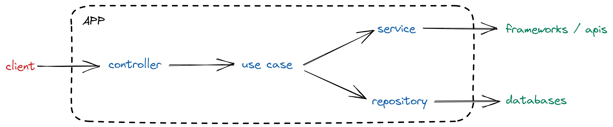
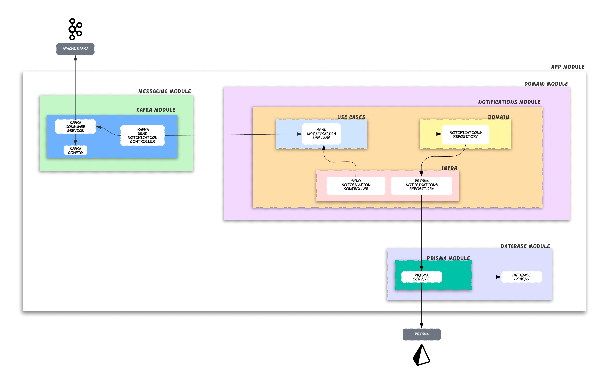
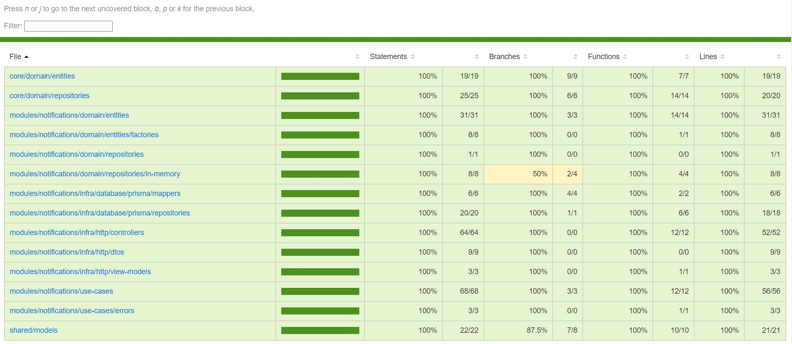
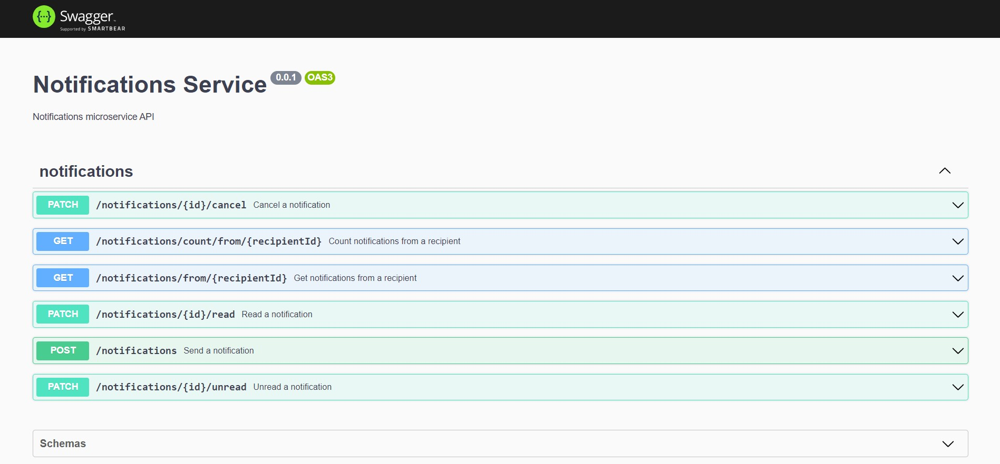

<h1 align="center">
    <p> 📨 Microserviço de Notificações </p>
</h1>

<p align="center">
    
    
    
    <br/>
</p>

## 🔖 Sobre

Microserviço de notificações desenvolvido com [Nestjs](https://nestjs.com/) no Ignite Lab de 2023. Com aplicação de melhoras através da utilização do [SOLID](https://medium.com/desenvolvendo-com-paixao/o-que-%C3%A9-solid-o-guia-completo-para-voc%C3%AA-entender-os-5-princ%C3%ADpios-da-poo-2b937b3fc530), [Clean Architecture](https://blog.cleancoder.com/uncle-bob/2012/08/13/the-clean-architecture.html) e [TDD](https://www.devmedia.com.br/test-driven-development-tdd-simples-e-pratico/18533)

## 💥 Utilização

- ### 👉 **Pré-requisitos**

  - É **necessário** possuir o **[Node.js](https://nodejs.org/en/)** instalado no computador
  - É **necessário** possuir um gerenciador de pacotes, como o **[Yarn](https://yarnpkg.com/)**, instalado no computador
  - É **necessário** possuir o **[Docker](https://www.docker.com/)** instalado no computador

1. Faça o clone do repositório:

   ```sh
     $ git clone https://github.com/Pedro-Manoel/notification-service.git
   ```

2. Entre na pasta do projeto:

   ```sh
     $ cd notification-service
   ```

3. Configure a aplicação utilizando o arquivo `.env.development` na fase de desenvolvimento, `.env.test` na fase de testes ou `.env.production` na fase de produção. Para o `.env.production` utilize o arquivo `.env.example` como base.

4. Execute o seguinte comando para fazer o download das dependências da aplicação:

   ```sh
   $ yarn install
   ```

5. Execute o seguinte comando para criar e executar o container no docker:

   ```sh
   $ yarn db:up
   ```

6. Execute o seguinte comando para criar as tabelas no banco de dados

   ```sh
   $ yarn db:migrate
   ```

7. Execute o seguinte comando para executar a aplicação no modo de desenvolvimento:

   ```sh
   $ yarn start:dev
   ```

8. Execute os comandos abaixo para executar os testes da aplicação:
   Todos os testes:

   ```sh
   $ yarn test
   ```

   Testes de unidade:

   ```sh
   $ yarn test:uni
   ```

   Testes E2E:

   ```sh
   $ yarn test:e2e
   ```

## 🚀 Tecnologias

- Desenvolvimento com a framework [Nestjs](https://nestjs.com/)
- Acesso e controle do banco de dados com o ORM [prisma](https://www.prisma.io/)
- Testes de unidade com [jest](https://jestjs.io/pt-BR/)
- Testes E2E com [supertest](https://www.npmjs.com/package/supertest)
- Verificação de lint com [eslint](https://eslint.org/)
- Correção de código com [prettier](https://prettier.io/)
- Documentação com [swagger](https://swagger.io/)
- Utilização de hooks do git com [husky](https://typicode.github.io/husky/#/)
- Integração assíncrona com [Apache kafka](https://kafka.apache.org/)

## 📦 Arquitetura

### 🏷️ Modelo Simplificado



### 🪧 Demostração do SEND NOTIFICATION



## ✅ Testes



➡️ Para acessar os testes clique [aqui](coverage/lcov-report/index.html)

## 📑 Swagger



🔰 Rota: **[http://localhost:3333/api-docs](http://localhost:3333/api-docs)**

## 📃 Licença

Esse projeto está sob a licença MIT. Veja o arquivo [LICENSE](LICENSE) para mais detalhes.
